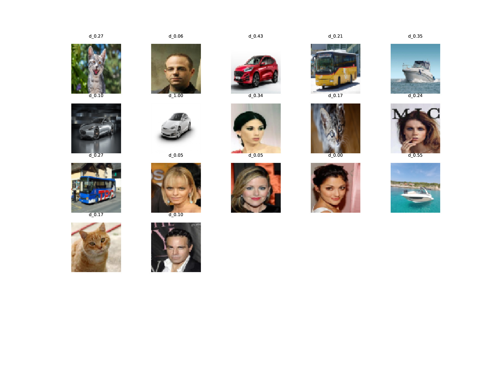

##### Disclaimer
This project is by David Bachmann (bacdavid). It is not published or affiliated.

# RND-O

Very simple method to detect outliers based on Random Network Distillation (https://arxiv.org/pdf/1810.12894.pdf). 

<div align="center">

<p align="justify">Model was trained on celebA (http://mmlab.ie.cuhk.edu.hk/projects/CelebA.html), therefore on celebrity faces. The normalized predicted distance from this distribution is denoted. </p>
</div>

## Details

### Random Network Distillation

- Use a target network (randomly initialized and fixed) and a prediction network which attempts to match the target network
- Target network is uses more layers than the prediction network to - hopefully - generate an embedding with large variance

### Loss

The loss function to train the model is simultaneously the outlier-score:
*Please note that `z` denotes the latent representation*
```
mse(z_target, z_predicted).
```

## Try it

Simply open the file 
```
train.py
```
and perform the required adjustments.
